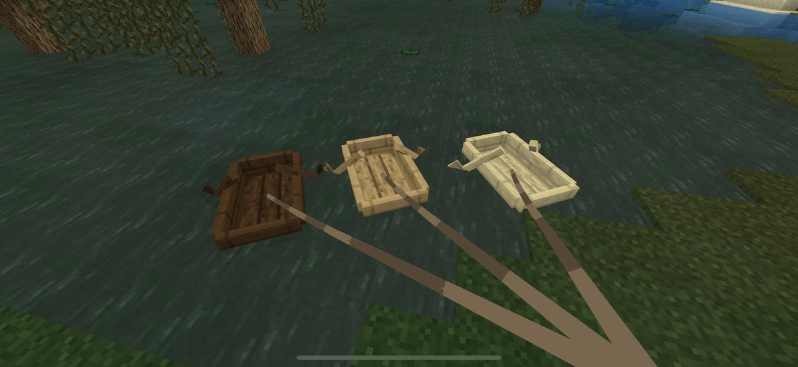

# 🛶 Boat Leash for Fabric 1.16.5

**Boat Leash** brings the modern, highly requested boat-leashing feature directly to **Minecraft 1.16.5**. Whether you need to transport villagers across oceans, organize your docks, or bring your pets on a river trip, Boat Leash seamlessly integrates vanilla-style boat pulling physics into the game.

---

## ✨ Features

- **Vanilla-Style Leashing**: Simply use a Lead on any boat to attach it!
- **Accurate Physics**: Beautifully coded momentum and pulling mechanics so your boats (and their passengers) naturally follow you or your primary vessel.
- **Accurate Visuals**: Fully implements the classic, sagging catenary 3D leash ribbon that correctly attaches from your hand to the boat. 
- **Mob Transport**: Easily pull boats containing mobs, animals, and villagers without breaking a sweat.
- **Zero Dependencies**: Completely standalone! **NO** Fabric API, Cloth Config, or ModMenu required. It runs instantly on any base Fabric installation.
- **Data Persistence**: Perfect NBT saving ensures leashes survive logouts, server restarts, and chunk unloads.
- **Java 8 Native**: Backported with maximum compatibility. Works flawlessly on older Java 8 environments alongside other legacy mods without crashing.
- **Vanilla Drops**: Breaking a leashed boat or unleashing it correctly drops your Lead back into the world.

## 📥 Installation

1. Make sure you have the [Fabric Loader](https://fabricmc.net/use/) installed for Minecraft 1.16.5.
2. Download the latest `boat-leash-1.5.jar` from the [Releases page](../../releases).
3. Drop the `.jar` file directly into your `.minecraft/mods` folder.
4. Launch the game and enjoy! (No Fabric API and Mod Menu recommended!)

## 🎮 How to Use

1. Hold a **Lead** in your hand.
2. **Right-click** on any Boat to attach the leash to it.
3. Start moving! You can walk on land or drive another boat, and the leashed boat will follow you.
4. To **unleash**, simply right-click the boat again, or tie the lead to a fence post.

## 🛠️ Compatibility

- **Minecraft Version:** `1.16.5`
- **Mod Loader:** Fabric
- **Multiplayer:** Fully Server-Side and Client-Side compatible. (Requires installation on both for optimal syncing and visuals).

## 📝 License

This project is open-source and available under the standard MIT License. Feel free to contribute, report issues, or use it in your modpacks!
